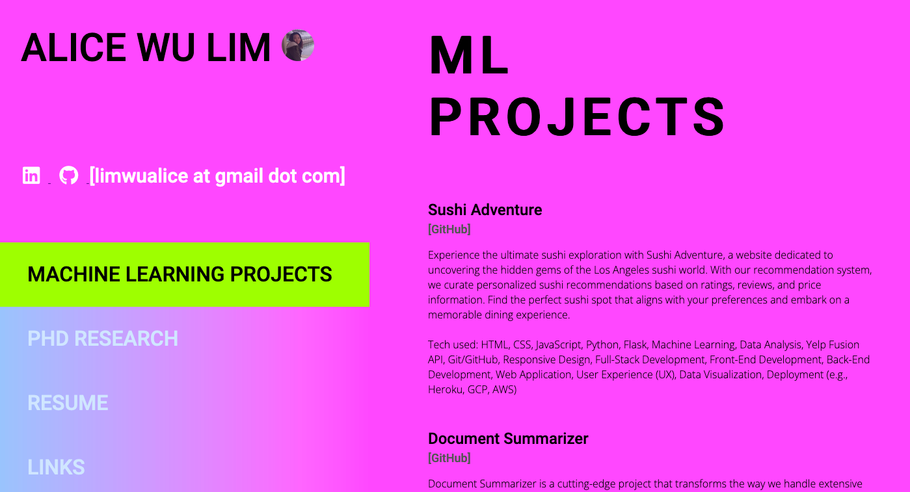

#Alice's Portfolio

Welcome to my portfolio! This repository showcases my skills, projects, and achievements as a data scientist and mathematician. Feel free to explore and learn more about my background and experiences.

##About Me

I am a data scientist with a strong background in mathematics. With a PhD in Mathematics from Syracuse University, I have a solid foundation in statistical analysis, machine learning, and data modeling. I am passionate about leveraging data-driven insights to solve complex problems and make informed decisions.

##Projects

Sushi Adventure

Experience the ultimate sushi exploration with Sushi Adventure, a website dedicated to uncovering the hidden gems of the Los Angeles sushi world. With our recommendation system, we curate personalized sushi recommendations based on ratings, reviews, and price information. Find the perfect sushi spot that aligns with your preferences and embark on a memorable dining experience.

Document Summarizer

The Document Summarizer project is an innovative solution that revolutionizes the way we handle large volumes of text. Using advanced natural language processing techniques, this tool automatically analyzes and condenses lengthy text documents into concise and coherent summaries. Whether you're a researcher, student, or professional dealing with research papers, reports, or articles, Document Summarizer saves you precious time and effort by distilling crucial insights quickly and accurately.

Visualization of Parking Data

As a volunteer with Hack for LA, I contributed to a project focused on visualizing parking data to understand the effects of parking policies on a neighborhood-by-neighborhood basis in the City of Los Angeles. My role involved connecting a data pipeline to the API, integrating Google Cloud Platform (GCP) with Looker for data visualization, and implementing data cleaning and processing techniques. This project allowed me to apply my data science skills to make meaningful contributions to urban planning and policy analysis.

Skills

    Data analysis and visualization
    Machine learning and predictive modeling
    Statistical analysis and hypothesis testing
    Python programming
    SQL and database management
    Data cleaning and preprocessing
    Data pipeline development and integration
    Version control with Git and GitHub
    Agile project management